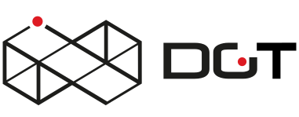

Hyperledger DGT SDK
-------------

DGT is an enterprise solution for building, deploying, and
running distributed ledgers (also called blockchains). It provides an extremely
modular and flexible platform for implementing transaction-based updates to
shared state between untrusted parties coordinated by consensus algorithms.

.
# install DGT node

#start devel 
./dgt-devel.sh dev1 up -d
#stop devel
./dgt-devel.sh dev1 down 

#For running shell run next cmd .
./dgt-devel.sh dev1 shell

