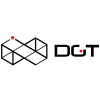

DGT SDK
-------------

DGT SDK is a Layer 1 platform for building, deploying, and
running distributed ledgers (also called blockchains). It provides an extremely
modular and flexible platform for implementing transaction-based updates to
shared state between untrusted parties coordinated by consensus algorithms.

